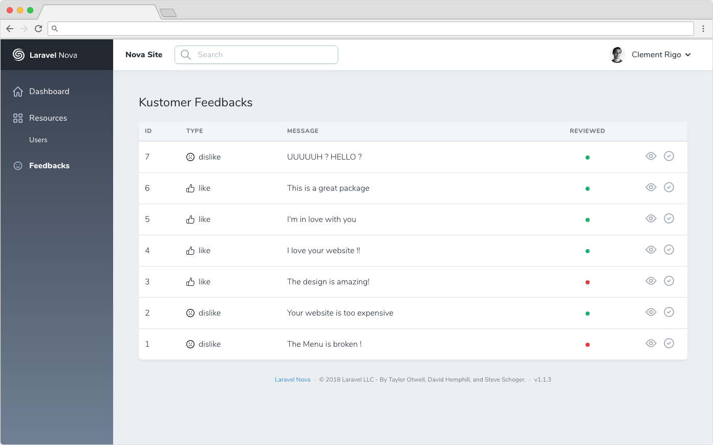

# Laravel Nova Kustomer Feedback

This package allows you to implement [Laravel Kustomer](https://github.com/mydnic/laravel-kustomer) into your Laravel Nova Dashboard.



## Requirements

You must have installed and configured [Laravel Kustomer](https://github.com/mydnic/laravel-kustomer)

## Installation

You can install the nova tool in to a Laravel app that uses [Nova](https://nova.laravel.com) via composer:

```bash
composer require mydnic/nova-kustomer
```

Next up, you must register the tool with Nova. This is typically done in the `tools` method of the `NovaServiceProvider`.

```php
// in app/Providers/NovaServiceProvder.php

// ...

public function tools()
{
    return [
        // ...
        new \Mydnic\NovaKustomer\NovaKustomer,
    ];
}
```

The MIT License (MIT). Please see [License File](LICENSE) for more information.
